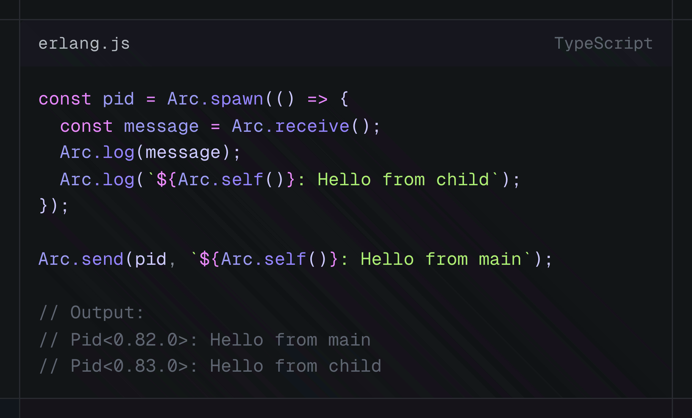
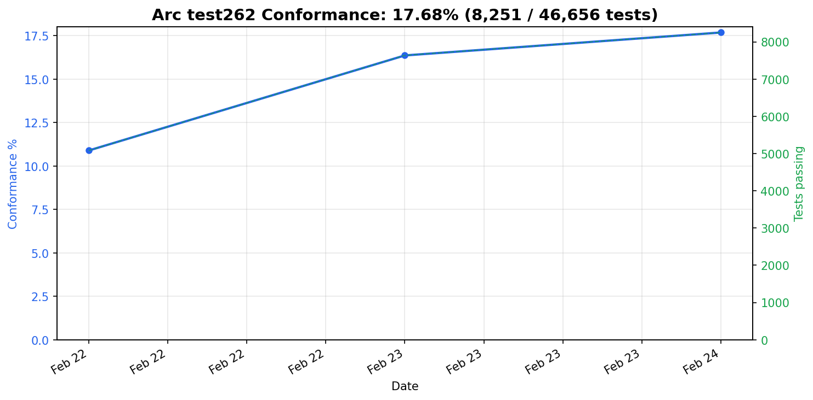

# arc

(Highly experimental) JavaScript on the BEAM



## Development

```sh
gleam test  # Run the tests
```

### Running test262

```sh
# Run the full test262 execution suite
TEST262_EXEC=1 gleam test

# Also write results to a JSON file
TEST262_EXEC=1 RESULTS_FILE=results.json gleam test

# Run parser-only test262 (faster, parse conformance only)
TEST262=1 gleam test
```


